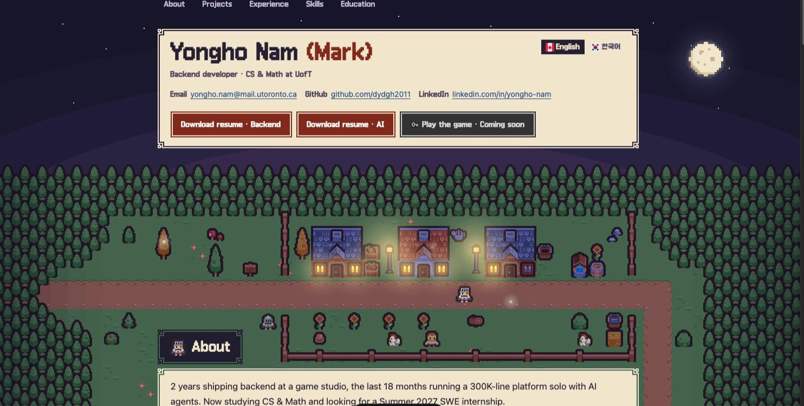
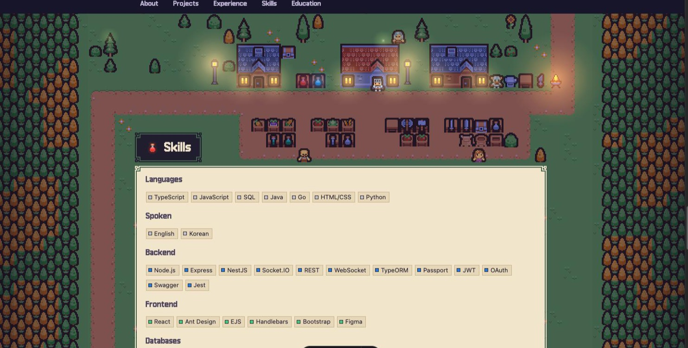
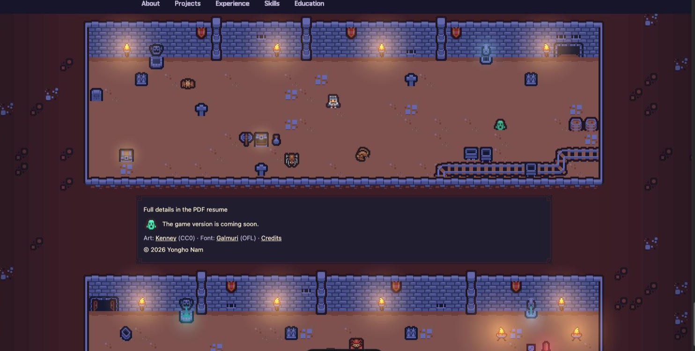
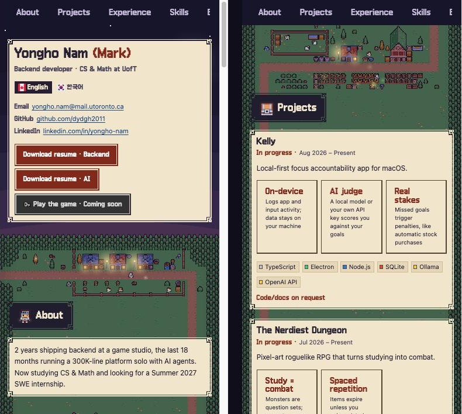

# Yongho (Mark) Nam — Portfolio

[](https://github.com/dydgh2011/portfolio/actions/workflows/deploy.yml)

**Live site: [dydgh2011.github.io/portfolio](https://dydgh2011.github.io/portfolio/)** · English and 한국어

My resume as a pixel-art RPG map. Each section of the resume is a scene on one long map at dusk: a village, a farm, a training ground, a market, a dark forest, and finally a dungeon. The resume text stays plain, readable HTML on top of it.



A roguelike game version, where you walk through the same resume, is planned (see the [roadmap](docs/ROADMAP.md)). Both are built from one content source, `content/`.

## Features

- **One map, one scene per section.** The page is a single tile map split into scenes (with the section titles) and content areas that stretch to fit the text. A road links every scene, and a knight walks through each one.
- **Living scenes.** Villagers, animals and monsters move; torches, campfires, lamps and windows glow and flicker; fireflies drift around and blink.
- **Same picture on every screen.** Below laptop width the map scales down as a whole, so a phone sees the same scene; the text shrinks only a little.
- **Built for recruiters.** Real HTML text, résumé PDFs (backend and AI versions), a clean print style, keyboard navigation (Space / arrow keys jump between sections), reduced-motion support, and English/Korean pages.
- **A map editor** (dev only) to paint the scenes, place actors, lights and fireflies, and preview them live.

<table>
  <tr>
    <td></td>
    <td></td>
  </tr>
  <tr>
    <td align="center">Market scene above Skills</td>
    <td align="center">Dungeon and boss room around the footer</td>
  </tr>
</table>

<p align="center"></p>

## Tech stack

- [Astro](https://astro.build) — static site, no client framework; a few small scripts
- Plain CSS — sky, lights, fireflies and actors are CSS animations
- [Lenis](https://github.com/darkroomengineering/lenis) — smooth wheel scrolling
- Node scripts with [pngjs](https://github.com/pngjs/pngjs) — build the map images from JSON scenes
- GitHub Actions + GitHub Pages — validate, build, deploy
- Art: [Kenney](https://kenney.nl) packs (CC0) and a few sprites drawn for this repo · Font: [Galmuri](https://github.com/quiple/galmuri) (OFL)

## Getting started

Requires Node.js 24 (it runs the TypeScript validation script directly).

```sh
cd site
npm install
npm run dev        # http://localhost:4321/portfolio/
```

| Command (in `site/`) | What it does |
|---|---|
| `npm run dev` | Dev server; builds the UI and map images first |
| `npm run build` | Static site in `site/dist/` |
| `npm run preview` | Serve the built site |
| `npm run validate` | Check `content/` (same as `node scripts/validate.ts` from the root) |

The map editor runs with the dev server at http://localhost:4321/portfolio/editor/. Saving a scene writes `site/scenes/*.json` and rebuilds the images. See [docs/SITE.md](docs/SITE.md#editing-the-map).

## Repository layout

```
portfolio/
├── content/              # the resume: data, text per language, icons, PDFs
│   ├── data/             # language-neutral: ids, dates, skills, game numbers
│   ├── i18n/en, i18n/ko/ # text only, keyed by the same ids
│   ├── icons/
│   └── resume/           # public PDF resumes (no phone number)
├── assets/
│   ├── kenney/           # CC0 art packs, shared by the site and the game
│   └── custom/           # sprites drawn for this repo (lights, construction)
├── site/                 # Astro site
│   ├── src/              # pages, components, styles
│   ├── scenes/           # map scenes (world.json is the page map)
│   ├── scripts/          # image builders and map helpers
│   └── editor/           # the map editor (dev only)
├── scripts/validate.ts   # content checks, run in CI
├── docs/                 # design notes and roadmap
└── .github/workflows/deploy.yml
```

## Updating content

All resume text lives in `content/`, never in the site code. Data (`content/data/`) and text (`content/i18n/<lang>/`) are kept apart, so adding a language is copying `i18n/en/` and translating it. Missing keys fall back to English. Details, style limits and checks: [docs/CONTENT.md](docs/CONTENT.md).

## Deployment

Every push to `master` runs `.github/workflows/deploy.yml`: validate the content, build the site, copy `content/` next to it (for the game later), and deploy to GitHub Pages. The site lives under `/portfolio/` (`base` in `site/astro.config.mjs`).

## Docs

- [docs/SITE.md](docs/SITE.md) — site design, the map, lights and fireflies, screen sizes, the map editor
- [docs/CONTENT.md](docs/CONTENT.md) — content model, how to update it, validation, repo rules
- [docs/GAME.md](docs/GAME.md) — game design (Phase 2+)
- [docs/ROADMAP.md](docs/ROADMAP.md) — what is done and what is next

## Credits

Art from [Kenney](https://kenney.nl) (CC0), font [Galmuri](https://github.com/quiple/galmuri) (SIL OFL 1.1), smooth scrolling by Lenis (MIT). Every asset and its license is listed in [CREDITS.md](CREDITS.md).
