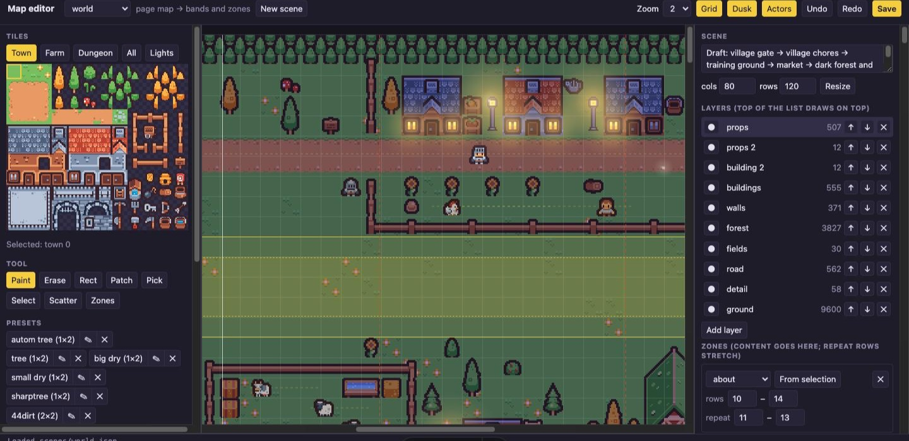

# Site design

The resume site (`site/`, Astro) shows the resume as one long pixel-art RPG map at dusk. It is built from the same free asset packs the game will use (see [CREDITS.md](../CREDITS.md)).

## Principles

- **Readability first.** Pixel font (Galmuri, OFL, with Hangul) only for headings, nav, and labels. Body text uses the visitor's system font.
- All resume text is real HTML text (selectable, searchable, screen-reader friendly). Never put text inside images or canvas.
- `image-rendering: pixelated` on all sprites. Sprites scale by whole numbers (×2) on wide screens.
- Respect `prefers-reduced-motion` (actors, lights, fireflies and smooth scrolling stop). Keep color contrast at WCAG AA.
- The print stylesheet removes the decorations, so printing the page gives a clean resume.
- Keep the first load light: no game engine on the resume site, only small images and CSS animations.
- Resume PDFs in `content/resume/` are the public copies: **no phone number**. Rebuild them from the private `.tex` with the phone line removed.

## Look

- **Panels and buttons** are 9-slice tiles (Kenney Fantasy UI Borders) drawn with CSS `border-image`. The sprites are white; `site/scripts/build-ui.mjs` tints them to the site palette before `dev`/`build` (change the sprite or color there).
- **The sky** (nav + header) is plain CSS in `site/src/styles/global.css`: colors `--sky-0…5` drawn as rings around a point below the horizon, stars as a `box-shadow` list, and a pixel moon (`site/src/assets/moon.svg`, placed by `.moon`) with a soft moonlight glow (`.moon-glow`). The `horizon` treeline (`site/scenes/horizon.json`) is centered like the map below it, so their tiles line up at any width.
- **Edge shade:** from where the edge forest starts (17 tiles either side of the center) the map and the horizon trees get darker toward the left and right, in one-tile steps (`--edge-shade`). The sky and the content are not shaded.
- **Flags** (Flag Pack) mark languages (`profile.json → languageFlags`) and places (`country` on experience/education).
- **Skill chips** use their element color from `elements.json`.

## The map

Everything below the header is one tall map, `site/scenes/world.json` (80 × 120 tiles of 16 px, shown at ×2). `site/scripts/build-ui.mjs` composes it, tints it to dusk, and slices it into bands and zones (see `site/scripts/world.mjs`). The scenes go from a village gate down through farm (above Experience), training ground (above Projects), market and a dark forest into a dungeon and a boss room.

- **Zones** are the rows where content sits (`about`, `experience`, `projects`, `skills`, `education`, `footer`, in page order: `ZONE_IDS` in `world.mjs`). A zone stretches to its content by repeating its **repeat rows**, rounded to whole rows so tiles are never cut. Keep the content column (cols 26–53) calm.
- **Bands** are the fixed scenes between zones. The section title sits at the bottom of the band, right above its content.
- **Actors** (the knight, villagers, animals, monsters) live in bands: `walk`, `wander`, or `path` through points. An actor is drawn in the band where most of its path is, clipped to it.
- **Lights** (`lights` in `world.json`): torches, braziers, campfires, street lamps, lit windows, and plain glows. Each has a sprite (fires animate; `assets/custom/lights.png`, drawn by `site/scripts/make-light-sprites.mjs`) and a soft glow that only adds light. Fires flicker; magic lights breathe. Types and defaults: `LIGHT_TYPES` in `world.mjs`.
- **Fireflies** (`fireflies` in `world.json`): groups that wander inside an area, each firefly on its own smooth loop, blinking, fading out and coming back somewhere else. Settings and defaults: `FIREFLY_DEFAULTS` in `world.mjs`. The loops come from a seed, so the editor preview matches the site.

## Screen sizes

- From 1280 px wide up, the map is drawn at full size (32 px tiles). Below that, the map, the horizon and everything on them scale down with the window (`--map-s`), so a phone sees the same scene as a laptop.
- The content scales less (`--ui-s`, down to 0.8 on phones), and phones get smaller headings and three metric cards per row.
- Below 1280 px the section titles move from the scene into the top of the content, so they don't cover the smaller scene.
- The scale values are set by a small script in `site/src/layouts/Base.astro` (`MAP_VIEW`, `PHONE`, `UI_MIN`).

## Interaction

- **Smooth scrolling:** mouse-wheel scrolling is smoothed with [Lenis](https://github.com/darkroomengineering/lenis) (MIT, `Base.astro`; `lerp` sets how smooth). Touch and trackpads stay native.
- **Nav links** stop right below the sticky nav (`scroll-padding-top` = nav height). On tall screens, rock is added below the map so the last section can still reach the top.
- **Keyboard:** Space goes to the next section (from the footer, back to the top); ↓/→ next, ↑/← previous (↑ first goes to the top of the current section). Stops are the elements with `data-stop`. Keys are left alone while typing, on focused buttons, with modifier keys, and while a dialog is open.
- **Game button:** until the game exists, it opens an "under construction" `<dialog>` (barricade and cones from `site/scripts/make-construction-sprites.mjs`). Esc, OK, or a click outside closes it.

## Editing the map

Run `cd site && npm run dev` and open http://localhost:4321/portfolio/editor/ (dev only, never deployed).

- **Tiles:** pick a tile on the left (Town / Farm / Dungeon, or All) and paint. Tools: paint, erase (or right-click), rect, patch, pick (or Alt+click), select, scatter, zones.
- **Patch** fills a rectangle from a set of 1–3 × 1–3 slots. Each way: 1 slot = used everywhere, 2 = first + rest, 3 = first + middle (repeated) + last. Sets live in `site/editor/library.json`.
- **Scatter** (T): drag an area to drop tiles and presets at random, by weight and density. "Scatter again" re-rolls the same area.
- **Select** an area to move it (drag), copy it (Shift+drag), or copy / cut / paste / delete it. Save a selection as a **preset** and stamp it anywhere.
- **Zones** (Z): zones are shaded (darker = repeat rows); white lines mark the content column, dashed lines the phone / laptop / desktop widths. Drag a zone's lines to resize it or change its repeat rows, drag the inside to move it, or drag empty rows to draw a new one. **Insert rows** / **Delete selected rows** move everything below (tiles, zones, actors, lights, fireflies). The stretch preview shows long sections.
- **Layers:** draw order, rename, hide (editor only).
- **Actors:** `walk`, `wander`, or `path` (points `col,row[,pause]`; add points by clicking the map).
- **Lights:** pick one in the **Lights** tab (left) and click the map to place it on the tile its object stands on. The Lights panel (right) changes color, size, power and motion, moves or deletes a light. Click a light on the map (Lights tab open) to select it; the selected one blinks and shows its number.
- **Fireflies:** the Fireflies panel (right) adds a group (in the selected area, if any) and sets count, color, power, size, speed, blink time ± random difference, shown/hidden time ± random difference, and "New paths". Select an area and press "From selection" to move a group.
- **Save** (Ctrl+S) writes `site/scenes/<name>.json` and rebuilds the images; the dev site reloads. Saving is blocked while there are problems (listed under Zones). Commit the JSON.
- Other world-kind files (like `world-draft.json`) are drafts: the editor opens them, but only `world.json` is built into the site.
